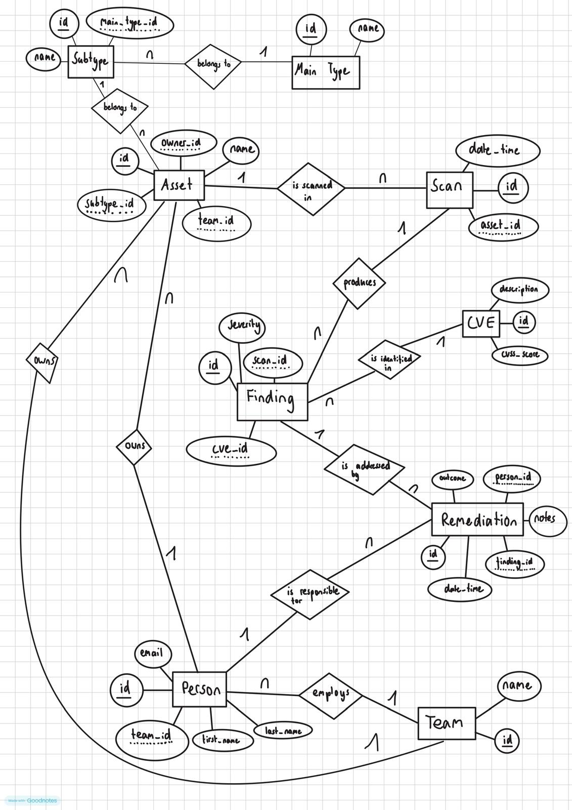
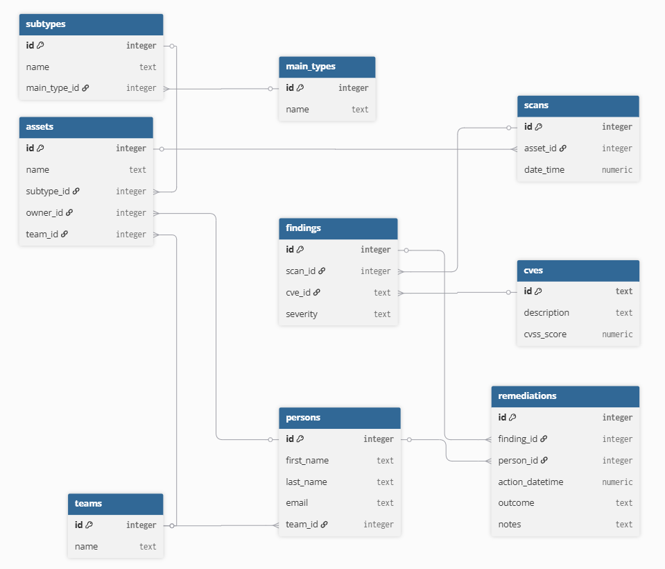

# Design Document

By Aaron Petzold

Video overview: https://youtu.be/iQI12sL9JjA

## Scope

The database for CS50 SQL includes all entities necessary to track security vulnerabilities (CVEs) found on assets during scans, and the remediation attempts made to fix them. As such, included in the database's scope is: 

* Persons, including basic identifying information 
* Teams, including basic identifying information
* Assets, including basic identifying information 
* Subtypes, including the name of the subtype
* Main Types, including the name of the main type
* Scans, including the date and time each scan occurred
* CVE, including the CVSS score and its official description
* Findings, which includes a contextual severity level for a specific asset
* Remediations, including the date and time the remediation attempt happened, as well as the outcome of the specific attempt

Out of scope are elements like companies, guides on how to handle or solve each finding or vulnerability, further person or team details such as job title, salary or descriptions, specific attempts that were made during a remediation, scan types, and other non-core attributes.

## Functional Requirements

This database supports:

* Adding, viewing, updating, and deleting records for every entity (teams, persons, assets, scans, CVEs, findings, remediations)
* Tracking which team a person belongs to and which assets they own
* Logging when an asset was scanned
* Recording what a scan found - which CVE, on which asset, and how severe it is in that context
* Logging one or more remediation attempts per finding, including who did it, when, and whether it worked
* Working out a finding's current status from its most recent remediation attempt, instead of storing status separately
* Answering questions like: which assets still have open findings, which findings involve a given CVE, and how long fixes typically take

This database does not support:

* Actually scanning anything - it only stores the results from scans run elsewhere
* Pulling CVE data automatically from the NVD - it has to be entered by hand
* Notifications or automatic escalation of overdue fixes
* Logins or permissions - anyone with access can see or edit everything
* Ownership history - only the current owner is stored, not who owned an asset before

## Representation

### Entities

The database includes the following entities:

#### Teams

The `teams` table includes:

* `id`, which specifies the unique ID for the team as an `INTEGER`. This column thus has the `PRIMARY KEY` constraint applied.
* `name`, which specifies the team's name (for example "Security Team") as `TEXT`, given `TEXT` is appropriate for name fields.

All columns in the `teams` table are required and hence should have the `NOT NULL` constraint applied.

#### Persons

The `persons` table includes:

* `id`, which specifies the unique ID for the person as an `INTEGER`. This column thus has the `PRIMARY KEY` constraint applied.
* `first_name`, which specifies the person's first name as `TEXT`.
* `last_name`, which specifies the person's last name as `TEXT`.
* `email`, which specifies the person's email address as `TEXT`. A `UNIQUE` constraint ensures no two persons share the same email.
* `team_id`, which is the ID of the team the person belongs to, as an `INTEGER`. This column thus has the `FOREIGN KEY` constraint applied, referencing the `id` column in the `teams` table to ensure data integrity.

All columns except `team_id` are required and hence have the `NOT NULL` constraint applied. `team_id` may be `NULL` if a person is not yet assigned to a team.

#### Main Types

The `main_types` table includes:

* `id`, which specifies the unique ID for the main type as an `INTEGER`. This column thus has the `PRIMARY KEY` constraint applied.
* `name`, which specifies the main type's name (for example "Hardware", "Software") as `TEXT`.

All columns in the `main_types` table are required and hence have the `NOT NULL` constraint applied.

#### Subtypes

The `subtypes` table includes:

* `id`, which specifies the unique ID for the subtype as an `INTEGER`. This column thus has the `PRIMARY KEY` constraint applied.
* `name`, which specifies the subtype's name (for example "Laptop", "Server") as `TEXT`.
* `main_type_id`, which is the ID of the main type this subtype belongs to, as an `INTEGER`. This column thus has the `FOREIGN KEY` constraint applied, referencing the `id` column in the `main_types` table to ensure data integrity.

All columns are required and hence have the `NOT NULL` constraint applied where a `PRIMARY KEY` or `FOREIGN KEY` constraint is not.

#### Assets

The `assets` table includes:

* `id`, which specifies the unique ID for the asset as an `INTEGER`. This column thus has the `PRIMARY KEY` constraint applied.
* `name`, which specifies the asset's name (for example "prod-server-01") as `TEXT`.
* `subtype_id`, which is the ID of the asset's subtype, as an `INTEGER`. This column thus has the `FOREIGN KEY` constraint applied, referencing the `id` column in the `subtypes` table to ensure data integrity.
* `owner_id`, which is the ID of the person responsible for the asset, as an `INTEGER`. This column thus has the `FOREIGN KEY` constraint applied, referencing the `id` column in the `persons` table to ensure data integrity.
* `team_id`, which is the ID of the team responsible for the asset, as an `INTEGER`. This column thus has the `FOREIGN KEY` constraint applied, referencing the `id` column in the `teams` table to ensure data integrity.

All columns except `owner_id` are required and hence have the `NOT NULL` constraint applied. `owner_id` may be `NULL` if an asset has not yet been assigned an owner / single person.

#### Scans

The `scans` table includes:

* `id`, which specifies the unique ID for the scan as an `INTEGER`. This column thus has the `PRIMARY KEY` constraint applied.
* `asset_id`, which is the ID of the asset that was scanned, as an `INTEGER`. This column thus has the `FOREIGN KEY` constraint applied, referencing the `id` column in the `assets` table to ensure data integrity.
* `date_time`, which specifies when the scan was performed. Timestamps in SQLite can be conveniently stored as `NUMERIC`, per SQLite documentation. The default value is the current timestamp, as denoted by `DEFAULT CURRENT_TIMESTAMP`.

All columns are required and hence have the `NOT NULL` constraint applied where a `PRIMARY KEY` or `FOREIGN KEY` constraint is not.

#### CVEs

The `cves` table includes:

* `id`, which specifies the CVE identifier (e.g., "CVE-2024-12345") as `TEXT`. This column thus has the `PRIMARY KEY` constraint applied. `TEXT` is used rather than `INTEGER`, since the NVD's own identifier is already unique and human-readable, so a separate key would be redundant.
* `description`, which specifies a short description of the vulnerability as `TEXT`, given `TEXT` can store long-form text.
* `cvss_score`, which specifies the CVE's standardized severity score, from 0.0 to 10.0. This column is represented with a `NUMERIC` type affinity, given it stores a float. A `CHECK` constraint ensures the value is between 0 and 10, the valid range per the CVSS specification.

All columns are required and hence have the `NOT NULL` constraint applied where a `PRIMARY KEY` constraint is not.

#### Findings

The `findings` table includes:

* `id`, which specifies the unique ID for the finding as an `INTEGER`. This column thus has the `PRIMARY KEY` constraint applied.
* `scan_id`, which is the ID of the scan that discovered the finding, as an `INTEGER`. This column thus has the `FOREIGN KEY` constraint applied, referencing the `id` column in the `scans` table to ensure data integrity.
* `cve_id`, which is the ID of the CVE identified in the finding, as `TEXT`. This column thus has the `FOREIGN KEY` constraint applied, referencing the `id` column in the `cves` table to ensure data integrity.
* `severity`, which specifies the contextual severity of this finding for the specific asset involved (e.g., "low", "medium", "high", "critical") as `TEXT`. This is distinct from the CVE's `cvss_score`, since the same CVE can pose different levels of risk depending on the asset it's found on (e.g., internet-facing vs. internal).

All columns are required and hence have the `NOT NULL` constraint applied where a `PRIMARY KEY` or `FOREIGN KEY` constraint is not.

#### Remediations

The `remediations` table includes:

* `id`, which specifies the unique ID for the remediation attempt as an `INTEGER`. This column thus has the `PRIMARY KEY` constraint applied.
* `finding_id`, which is the ID of the finding this attempt addresses, as an `INTEGER`. This column thus has the `FOREIGN KEY` constraint applied, referencing the `id` column in the `findings` table to ensure data integrity.
* `person_id`, which is the ID of the person who performed or is responsible for the attempt, as an `INTEGER`. This column thus has the `FOREIGN KEY` constraint applied, referencing the `id` column in the `persons` table to ensure data integrity.
* `action_datetime`, which specifies when the remediation attempt occurred. As with `scans.date_time`, this is stored as `NUMERIC`, defaulting to `CURRENT_TIMESTAMP`.
* `outcome`, which specifies the result of this specific attempt (e.g., "successful", "failed", "in_progress", "rolled_back") as `TEXT`. A `CHECK` constraint restricts values to this fixed set.
* `notes`, which specifies optional free-text notes about the attempt, as `TEXT`.

All columns except `notes` are required and hence have the `NOT NULL` constraint applied.
### Relationships

The below entity relationship diagrams describe the relationships among the entities in the database.

---

---

---

As detailed by the diagram:

* One main type can have 0 to many subtypes. 0, if the main type doesn't have any subtypes yet, and many if it has multiple subtypes (such as servers, laptops, mobile devices, routers, switches, IoT sensors, all of which belong to the main type hardware). One subtype belongs to one and only one main type.
* One subtype can be associated with 0 to many assets. 0, if the subtype hasn't been asigned to an asset yet, and many if it has been asigned to multiple assets. One asset belongs to one and only one subtype.
* One team can employ 0 to many persons. 0, if the team doesn't yet have any members, and many if multiple people are assigned to a single team (for example "Security Team"). One person belongs to one and only one team.
* One person can be responsible for 0 to many remediations. 0, if the person isn't responsible for any remediations, and many if the person is responsible for multiple remediations. A remediation is made by one and only person. It is assumed that a single person (and not the whole team) holds accountability for a remediation.
* One persons can own 0 to many assets. 0, if the person doesn't own any, and many if the person owns mutiple assets. One asset is owned by one or no person. 
* One team can own 0 to many assets. 0, if the teams doesnt't own any, and many if the team owns multiple assets. One asset is owned by one and only one team.
* One asset can be scanned 0 to many times. 0, if the asset hasn't been scanned yet, and many if it has been scanned multiple times. One scan is associated with one and only one asset. 
* One scan produces 0 to many findings. 0, if the scan didn't find any issues, and many if it found several vulnerabiliites or exposures. One finding is associated with one and only one scan. 
* One finding is addressed by 0 to many remediations. 0, if there haven't been any remediation attempts yet, and many if there are several remediation attempts. One remediation is associated with one and only one finding.
* One CVE can be identified in 0 to many findings. 0, if the specific CVE hasn't yet been identified, and many if it has been identified in multiple findings. One finding identifies one and only one CVE. 

## Optimizations

Per the typical queries in `queries.sql`, it is common for users of the database to access findings with their corresponding scans and assets. For that reason, indexes are created on the `"remediations"."finding_id"`, `"findings"."scan_id"`, and `"scans"."asset_id"` columns to speed up those joins.

Similarly, it is also common practice for a user of the database to concerned with viewing each findings current status. As such, a view is created to speed up this process by users not having to type the statement themselves.

## Limitations

The current schema does not allow a user who has made a remediation to be deleted, since `"remediations"."person_id"`  has the `NOT NULL` constraint applied.